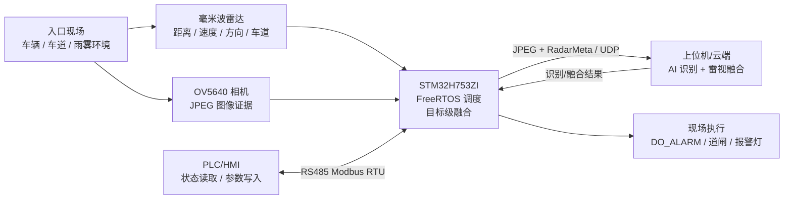
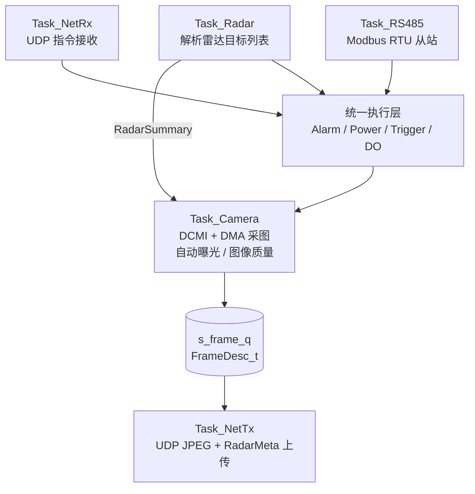
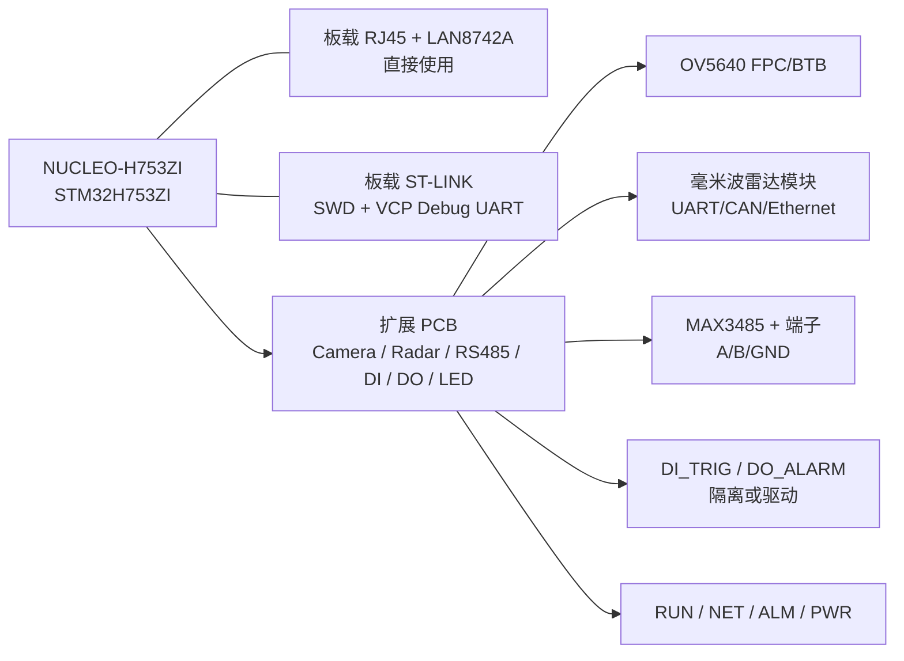

# 高速入口车辆检测相机综合设计文档

> 文档编号: 03
> 整合来源: `03_Architecture.md`、`08_TechnicalDesign.md`、`09_CommunicationProtocol.md`、`10_Hardware_Pinout_Productization.md`、`14_Business_Block_Diagram_Visio_Guide.md`
> 适用范围: 当前雷达视觉融合相机方案、作品集/PPT 方案讲解、扩展 PCB 与产品化硬件规划

## 1. 项目背景与挑战

本项目面向高速入口、园区通行口和工业出入口等场景，当前方案定义为一套“雷达 + 视觉”的工业边缘检测相机。设备侧由 `STM32H753ZI` 负责实时调度，连接 `OV5640` 相机和毫米波雷达模块，完成车辆目标触发、图像采集、基础预处理、`JPEG + RadarMeta` 上传、`RS485 Modbus RTU` 工业通信、`DI/DO` 联动和状态指示。上位机或云端负责车牌/车型识别、复杂雷视融合、事件记录和结果管理；`PLC/HMI` 负责现场节拍、联锁、参数配置和执行机构控制。

该项目的挑战不是单一算法问题，而是业务闭环、嵌入式软件、硬件接口和现场环境共同带来的系统工程问题。可以打个比方：相机像人的眼睛，负责留下图像证据；雷达像距离感和速度感，负责在雨雾、逆光或低照度下判断“目标是否存在、离多远、是否接近”；`STM32H753ZI` 则像现场调度员，把采集、传输、控制和状态上报安排到稳定的实时流程里。

当前方案需要解决的核心挑战如下：

| 挑战类型 | 具体表现 | 当前方案 |
|---|---|---|
| 业务闭环挑战 | 车辆进入、抓拍、上传、识别、告警、PLC/HMI 联动需要形成完整链路 | 设计“雷达触发 -> 相机抓拍 -> 云端融合 -> 现场执行”的闭环 |
| 恶劣环境挑战 | 雨雾、逆光、低照度、镜头水滴会降低视觉识别和触发可靠性 | 雷达提供目标存在、距离、速度和方向, 相机提供图像证据 |
| 实时调度挑战 | 相机采集、网络发送、雷达输入、RS485 响应需要并行运行 | 使用 FreeRTOS 多任务、双缓冲、消息队列和事件驱动状态机 |
| 通信集成挑战 | 设备同时面对云端/上位机、PLC/HMI、雷达模块和调试接口 | 以太网负责图传, RS485 负责工业控制, 雷达使用独立输入接口 |
| 硬件产品化挑战 | 相机、雷达、RS485、DI/DO、电源和调试接口需要能落到扩展 PCB | 采用 NUCLEO-H753ZI + 扩展 PCB 验证, 后续可演进为量产主板 |
| 资源边界挑战 | H753 性能较强但不是 AI SoC, 不能无限堆本地推理和大缓存 | H753 做实时控制和轻量目标级融合, 复杂识别放到云端/上位机 |

因此, 本文后续只围绕当前雷达视觉融合方案展开, 重点说明业务闭环、软硬件实现、通信协议和扩展 PCB 落地方式。
## 2. 整体方案设计

### 2.1 系统定位

当前方案定位为“雷达视觉融合的工业边缘检测相机”。它不是本地 HMI 终端, 也不是把所有 AI 推理都放在 MCU 上的独立识别主机。它的核心价值是把车辆目标触发、图像证据采集、工业通信和现场联动整合在一个边缘设备中。

系统分工如下：

| 层级 | 主要职责 |
|---|---|
| `OV5640` 相机 | 采集 JPEG 图像证据, 提供视觉侧信息 |
| 毫米波雷达模块 | 输出目标存在、距离、速度、方向、车道、置信度 |
| `STM32H753ZI` | 实时调度、抓拍区判断、目标级融合、UDP/Modbus、DI/DO |
| 上位机/云端 | 车牌/车型识别、复杂雷视融合、事件判断、存储管理 |
| `PLC/HMI` | 现场触发、参数配置、状态读取、联锁和执行机构控制 |

### 2.2 总体业务闭环



这条链路可以理解为“雷达先发现, 相机留证据, 平台做判断, 现场执行动作”。雷达不替代相机, 因为它不能提供车牌和颜色; 相机也不替代雷达, 因为在雨雾和强逆光下它可能看不清。两者配合后, 系统在复杂现场中的触发可靠性更高。

### 2.3 方案边界

当前方案的主链路包括雷达、相机、以太网、RS485、DI/DO 和状态指示。`LCD`、`SDRAM`、本地复杂 AI、云台/舵机不作为当前主链路功能。它们可以作为后续扩展讨论, 但不能混入当前方案的基础设计, 否则会增加 PCB、BOM、软件和调试复杂度。

当前主方案边界如下：

| 类别 | 当前方案处理方式 |
|---|---|
| 图像采集 | `OV5640 + DCMI + DMA`, 输出 JPEG 图像 |
| 目标触发 | 毫米波雷达目标列表 + 抓拍区判断 |
| 图像上传 | UDP JPEG 分片 + `RadarMeta` 元数据 |
| 工业控制 | `USART2 + MAX3485`, `RS485 Modbus RTU` |
| 现场联动 | `DI_TRIG`, `DO_ALARM`, `RUN/NET/ALM/PWR` 状态指示 |
| 复杂识别 | 云端/上位机完成, H753 不承担完整车牌/车型识别 |
| 扩展计算 | 后续可通过 `SDRAM/QSPI/AI 模块` 增强, 当前不作为主链路 |
## 3. 软件设计

### 3.1 软件架构原则

软件设计遵循三个原则：

| 原则 | 说明 |
|---|---|
| 采集与传输解耦 | 相机采集和 UDP 发送通过双缓冲和消息队列连接 |
| 控制源统一 | 云端 UDP 指令和 `RS485 Modbus RTU` 寄存器写入最终进入统一执行层 |
| 雷达只做目标级输入 | H753 只解析雷达目标列表，不处理原始 ADC、复杂点云或深度雷视融合 |

H753 的角色是稳定实时控制核心。它适合做 DMA 采集、RTOS 调度、协议转换、轻量滤波、状态机和目标级判断；不适合承担本地车牌识别、复杂 CNN/OCR、雷达点云聚类和深度雷视融合。

### 3.2 FreeRTOS 任务拓扑



任务优先级不是按“模块重要性”拍脑袋设置, 而是按响应时间、任务周期、数据依赖、阻塞行为、单次执行时间和资源竞争综合确定。原则是: 硬实时/短响应任务优先, 长耗时任务拆分执行, 会阻塞等待外设或网络的任务不能长时间占用高优先级。

| 任务 | 优先级建议 | 调度方式 | 设置依据 | 职责 |
|---|---:|---|---|---|
| `Task_Camera` | High | 事件驱动 + 低频健康超时 | 依赖雷达触发和 DMA 完成事件, 抓拍窗口短; 无目标时只做低频健康采集, 不能被网络发送拖住 | 启动 DCMI/DMA，处理帧描述符，执行自动曝光和图像质量判断 |
| `Task_NetTx` | AboveNormal | 队列驱动 | 依赖 `s_frame_q`, 单帧 UDP 分片耗时较长, 需要及时清空帧队列但不能抢占相机采集 | 从帧队列取图像，通过 Netconn UDP 分片发送 |
| `Task_Radar` | Normal+ | 驱动事件/短周期轮询过渡 | 雷达目标是相机抓拍前置条件, 数据包短, 执行时间短, 应快速生成 `RadarSummary` | 读取雷达目标列表，生成触发状态和目标元数据 |
| `Task_RS485` | Normal | 中断接收 + 帧完成事件 | 面向 PLC/HMI, 响应需确定但数据量小; 不应被图传长期饿死 | 解析 Modbus RTU，处理寄存器读写 |
| `Task_NetRx` | Normal | Netconn 阻塞接收 | 云端命令实时性低于抓拍和工业控制, 可阻塞等待网络数据 | 接收云端指令，分发到统一执行层 |
| `Task_IdlePower` | Low | 空闲低功耗任务 | 只有在高优先级任务阻塞/等待时才运行, 不参与业务决策 | 周期性让出 CPU 并执行 `WFI`, 降低空闲功耗 |

事件驱动任务包括 `Task_Radar`、`Task_Camera`、`Task_NetTx`、`Task_RS485` 和 `Task_NetRx`。其中 `Task_Radar` 由雷达数据到达触发, `Task_Camera` 由雷达状态、外部抓拍请求和 DMA 完成事件触发, 同时保留低频健康超时; `Task_NetTx` 由帧队列触发, `Task_RS485` 由串口接收完成或 Modbus 帧间隔触发, `Task_NetRx` 由 Netconn 阻塞接收唤醒。`Task_IdlePower` 采用低优先级空闲调度, 避免干扰主链路。

资源竞争控制如下: 相机 DMA 写入帧缓冲时, `Task_NetTx` 只能发送已封装完成的另一块缓冲; LwIP 调用集中在网络任务内, 不跨线程直接操作 Raw API; RS485 和 UDP 命令不直接驱动硬件, 而是进入统一执行层, 由执行层仲裁报警、功耗和状态切换。

### 3.3 图像链路

相机链路基于 `OV5640 + DCMI + DMA`。JPEG 模式用于图像上传，灰度路径用于轻量检测和图像质量分析。当前 `640x480 JPEG` 通过 `100KB` 帧缓冲接收, 并使用双缓冲机制：

```text
Frame Buffer A  -> Camera DMA 写入
Frame Buffer B  -> NetTx 发送上一帧
两者交替使用，避免采集和发送互相阻塞
```

代码实现中, DCMI 帧完成回调通过线程标志通知 `Task_Camera`, 避免用 1ms 轮询等待 DMA 完成; `Task_Camera` 本身通过相机事件标志等待外部抓拍请求, 超时后才执行低频健康采集。

当前方案中, 主触发来自雷达目标列表和抓拍区判断。图像侧主要负责证据采集、曝光质量判断和低频健康抓拍, 不再把纯视觉运动检测作为正常业务触发依据。

### 3.4 雷达驱动状态机

当前方案采用雷达事件驱动状态机：

| 状态 | 触发条件 | 相机行为 | 上传策略 |
|---|---|---|---|
| `RADAR_GUARD` | 雷达无目标或目标远离抓拍区 | 相机休眠或低频健康抓拍 | 不上传或低频上传 |
| `ARMED_STANDBY` | 雷达发现目标接近 | 唤醒相机，准备曝光 | 可上传状态或低频预览 |
| `ACTIVE_CAPTURE` | 目标进入抓拍区 | JPEG 抓拍，绑定雷达元数据 | 上传 `JPEG + RadarMeta` |
| `FAULT_FALLBACK` | 雷达超时、通信错误或目标异常 | 回退低频健康抓拍和故障标记 | 上传低频 JPEG，并标记故障 |

可以把这套逻辑理解为“雷达当门铃，相机当摄像师”。没有人靠近时，相机无需一直高频工作；雷达发现目标接近时，相机提前准备；目标进入抓拍区时，相机拍下证据图像。

### 3.5 内存与稳定性边界

H753 片上内存需要同时服务相机、以太网、LwIP 和 RTOS：

| 区域 | 用途 |
|---|---|
| D1 AXI-SRAM | FreeRTOS Heap、主栈、应用变量 |
| D2 SRAM | 双帧缓冲、ETH DMA 描述符、LwIP Heap、雷达元数据 |
| D3 SRAM | 低功耗保留或后续扩展 |

稳定性策略：

| 风险 | 控制方式 |
|---|---|
| 网络拥塞导致队列堆积 | 帧队列满时丢弃最新帧，Camera 不阻塞 |
| 网络协议栈线程安全 | 网络收发统一使用 Netconn API, 避免跨线程直接调用底层 Raw API |
| 雷达数据异常 | 进入 `FAULT_FALLBACK`，启用低频健康抓拍并标记故障状态 |
| 多控制源冲突 | 执行层采用 Last-Write-Wins，接口不关心命令来源 |

## 4. 硬件设计

### 4.1 硬件设计目标

当前硬件方案以 `NUCLEO-H753ZI + 扩展 PCB` 作为验证形态, 后续可演进为芯片级量产主板。扩展 PCB 的作用不是重复开发板已有资源, 而是把项目真正需要的外设接口补齐: 相机接口、雷达接口、`RS485`、`DI/DO`、状态灯、电源分配和必要的保护电路。

设计目标如下：

| 目标 | 说明 |
|---|---|
| 复用开发板资源 | 复用 NUCLEO 板载 `LAN8742A + RJ45`、ST-LINK、Debug UART |
| 补齐业务接口 | 扩展 PCB 负责 `OV5640`、雷达、`RS485`、`DI/DO`、状态灯 |
| 保持工业可接入 | 现场接口按端子、保护、隔离和明确网络名设计 |
| 控制 BOM 和复杂度 | 当前方案不引入板载 `LCD`、`SDRAM`、云台驱动 |
| 支持后续演进 | 预留 `QSPI/SDRAM/AI 模块` 的评估空间, 但不混入主链路 |

### 4.2 扩展 PCB 总体连接

扩展 PCB 推荐通过 `CN11 + CN12` ST Morpho 连接器与 `NUCLEO-H753ZI` 对接。以太网和调试资源直接使用开发板已有接口, 不在扩展板上重复实现。



扩展 PCB 分区建议：

| 分区 | 内容 | 设计要点 |
|---|---|---|
| 相机区 | `J_CAM`、2.8V/1.8V LDO、DCMI/SCCB | 靠近连接器, 缩短 DCMI 线长, 模拟电源低噪声 |
| 雷达区 | `J_RADAR`、雷达电源、ESD、安装净空 | 远离高速数字线和相机模拟电源, 天线方向保持净空 |
| 工业接口区 | `MAX3485`、RS485 端子、DI/DO、TVS/光耦 | 靠板边, 便于接线和浪涌泄放 |
| 状态指示区 | `RUN/NET/ALM/PWR` LED | 面向外壳可视方向, 限流电阻就近放置 |
| 电源区 | 5V/3.3V 分配、相机 LDO、雷达电源 | 电源入口保护, 大电流和模拟电源分区 |

### 4.3 扩展 PCB 核心连接表

| 模块 | 关键信号 | MCU/开发板连接 | 外部连接 |
|---|---|---|---|
| `OV5640` | `D0~D7`, `HSYNC`, `VSYNC`, `PIXCLK` | `PC6/PC7/PE0/PE1/PE4/PB6/PE5/PE6/PA4/PG9/PA6` | `J_CAM` FPC/BTB |
| `OV5640 Ctrl` | `RST`, `PWDN`, `SCL`, `SDA`, 可选 `XCLK` | `PF2/PF8/PB8/PB9/PA8` | `J_CAM` |
| Radar | `RADAR_TX/RX` 或 `CANH/CANL`, `INT`, `RST` | 待最终模块选型固定 | `J_RADAR` |
| RS485 | `RO`, `DI`, `/RE`, `DE` | `PD6/PD5/PD4/PD4` | `MAX3485` |
| RS485 Bus | `A`, `B`, `GND` | 不直接接 MCU | `J_RS485` 端子 |
| DI | `DI_TRIG` | `PC13` | 光耦/端子 |
| DO | `DO_ALARM` | `PD15` | 晶体管/光耦/端子 |
| LED | `ALM/RUN/NET` | `PB14/PB0/PB7` | 板载状态灯 |
| Debug | `SWD`, `USART3 VCP` | 开发板板载 | 不在扩展 PCB 重复实现 |

`MAX3485` 必须按芯片引脚名连接, 不要只写“RS485 芯片”:

| MAX3485 引脚 | 连接 |
|---|---|
| `RO` | `PD6 / RS485_RX` |
| `/RE` | 与 `DE` 并到 `PD4 / RS485_DE` |
| `DE` | 与 `/RE` 并到 `PD4 / RS485_DE` |
| `DI` | `PD5 / RS485_TX` |
| `GND` | 系统地或隔离侧地 |
| `A` | `J_RS485-1 / RS485_A`, 并接终端电阻和 TVS |
| `B` | `J_RS485-2 / RS485_B`, 并接终端电阻和 TVS |
| `VCC` | `3V3`, 就近放 `0.1uF` 去耦 |

### 4.4 器件选型建议

| 器件/模块 | 推荐方向 | 选型理由 |
|---|---|---|
| MCU | `STM32H753ZIT6` | 480MHz M7, DCMI, Ethernet MAC, 多 UART/CAN, SRAM 资源较充足 |
| 相机 | `OV5640` 模组 | 支持 JPEG 输出, 降低 MCU 压缩压力 |
| 以太网 PHY | 复用 NUCLEO 板载 `LAN8742A` | 开发阶段减少硬件风险 |
| RS485 收发器 | `MAX3485/SN65HVD75` 类 3.3V 器件 | 兼容 MCU 电平, 外围简单, 适合 Modbus RTU |
| 雷达模块 | 输出目标列表的毫米波雷达模块 | MCU 只解析结果, 不处理原始 ADC/点云 |
| DI 输入 | 光耦隔离输入 | 适应工业现场干扰和不同电平 |
| DO 输出 | MOSFET/晶体管/光耦输出 | 驱动报警器、继电器或 PLC 输入 |
| 电源 | `12~24V -> 5V -> 3.3V/2.8V/1.8V` | 满足工业供电、MCU、相机和雷达需求 |
| 保护 | TVS/ESD/终端电阻/偏置电阻 | 提高 RS485、雷达接口、电源入口抗扰度 |

雷达模块选型要重点看四项: 是否输出目标列表、接口是否独立于 PLC 的 RS485、供电电流和安装视场是否适合入口车道。若模块只输出原始点云或需要主控做大量 FFT/聚类, 不适合当前 H753 主控方案。

### 4.5 PCB 布局与可靠性要点

- `DCMI`、`PIXCLK`、`RMII` 等高速线短、直、少过孔, 避免穿越噪声区域。
- 相机模拟电源 `2.8V/1.8V` 使用低噪声 LDO, 与雷达和工业接口噪声隔离。
- `RS485` 端子、TVS、终端电阻靠板边放置, `A/B` 差分线保持对称和清晰网络名。
- `DI/DO` 与相机数字总线分区, 工业接口优先考虑隔离和浪涌路径。
- 雷达天线一体模块需要前向净空, 不应被金属外壳、铜皮或排线遮挡。
- 舵机/云台不进入当前主 PCB 设计; 若后续扩展, 应独立电源和独立 SKU。

### 4.6 当前不纳入主设计的硬件

| 硬件 | 当前处理 |
|---|---|
| `LCD` | 不纳入主设计, 现场显示交给 HMI 或上位机 |
| `SDRAM` | 当前主链路不需要, 仅在边缘计算增强中评估 |
| 板载云台/舵机 | 不纳入当前方案, 执行机构由 PLC 或外部控制器负责 |
| 本地 AI 加速器 | 不纳入主链路, 可作为后续扩展模块 |
## 5. 通信协议

### 5.1 通信通道

| 通道 | 物理层 | 协议 | 职责 |
|---|---|---|---|
| Ethernet | RMII 100Mbps | UDP，远期 MQTT | JPEG 图传、云端指令、设备管理 |
| RS485 | `USART2 + MAX3485` | Modbus RTU | PLC/HMI 控制、参数读写、状态查询 |
| Radar In | UART/CAN/Ethernet | 厂商目标列表协议 | 目标存在、距离、速度、方向、车道 |

### 5.2 UDP 图传与雷达元数据

JPEG 图像通过 UDP 分片上传。当前协议建议为每片附加 `NetChunkHdr_t`，包含 `magic`、`frame_id`、`chunk_idx`、`chunk_cnt`、`total_size` 和标志位。当前雷达视觉方案中，标志位增加 `radar_valid` 和 `radar_triggered`。

雷达目标信息通过 `RadarMeta_t` 与图像帧关联：

| 字段 | 说明 |
|---|---|
| `frame_id` | 对应 JPEG 帧序号 |
| `timestamp_ms` | MCU 时间戳 |
| `radar_track_id` | 雷达目标 ID |
| `range_cm` | 目标距离 |
| `speed_cms` | 目标速度 |
| `azimuth_deg_x10` | 目标方位角 |
| `lane_id` | 车道编号 |
| `confidence` | 雷达目标置信度 |
| `fusion_flags` | 抓拍区、接近、雷达超时、图像低质量等标志 |

上位机或云端按 `frame_id` 或时间戳关联 JPEG 与 `RadarMeta`。图像侧提供证据，雷达侧提供全天候目标确认。

### 5.3 当前上传数据是否属于视频流

严格来说, 当前项目上传的数据不应称为标准视频流, 更准确的说法是“JPEG 帧序列”或“JPEG 图像分片上传”。设备把每一帧 JPEG 按 UDP 载荷大小切成多个分片发送, 接收端再按 `frame_id/chunk_idx` 重组为单张 JPEG 图片。

它和常见视频流的区别如下:

| 类型 | 典型协议/格式 | 是否连续编码 | 本项目是否属于 |
|---|---|---:|---:|
| 标准视频流 | RTSP/RTP/H.264/H.265/MJPEG over HTTP | 是 | 否 |
| MJPEG 类帧流 | 连续 JPEG 帧, 有固定流封装 | 近似 | 可演进到该形态 |
| JPEG 帧序列上传 | UDP 分片 + 帧号重组 | 否 | 是 |
| 事件抓拍 | 触发后上传单帧/多帧 JPEG | 否 | 当前雷达触发方案更接近该形态 |

因此, 在简历或方案中建议表述为 `UDP JPEG 图传`、`JPEG 帧分片上传` 或 `事件触发图像上传`。如果后续要做真正视频流, 需要增加标准封装、码率控制、时间戳同步、丢包恢复和播放器/服务端协议适配。可以打个比方: 当前方案像“连续寄出一张张照片”, 视频流则像“按固定格式播放的一卷胶片”。

### 5.4 Modbus RTU 寄存器

`RS485 Modbus RTU` 面向 `PLC/HMI`，用于现场控制和状态读取。典型功能包括：

| 区域 | 示例 |
|---|---|
| 设备状态 | `POWER_MODE`、`NET_STATE`、帧计数、发送计数 |
| 图像质量 | `BRIGHTNESS`、`SHARPNESS`、`JPEG_SIZE` |
| 雷达状态 | `RADAR_STATE`、`RADAR_TARGET_COUNT`、`RADAR_RANGE_CM`、`RADAR_SPEED_CMS` |
| 融合状态 | `FUSION_STATE`、`RADAR_IN_CAPTURE_ZONE`、`FUSION_CONFIRMED` |
| 控制命令 | `CMD_TRIGGER`、`CMD_POWER_MODE`、`CMD_ALARM`、`CMD_RADAR_ENABLE` |
| 配置参数 | 目标 IP、UDP 端口、抓拍区距离、雷达超时、最小置信度 |

### 5.5 双控制源策略

系统同时支持云端 UDP 指令和 `PLC/HMI` Modbus 写寄存器。两者都进入统一执行层，执行层不关心命令来源。冲突时采用 Last-Write-Wins，即最后一次有效写入生效。

```text
云端 UDP 指令 ───────┐
                    ├── 统一执行层 -> Alarm / Trigger / Power / DO
Modbus 寄存器写入 ───┘
```

## 6. 应用对象与场景

### 6.1 主要应用对象

| 对象 | 需求 |
|---|---|
| 高速入口车辆检测 | 抓拍车辆、上传图像、辅助识别和告警 |
| 园区/厂区道闸 | 与门禁、道闸、HMI、上位机联动 |
| 工业物流出入口 | 记录车辆或货物流转，配合 PLC 节拍控制 |
| 恶劣天气场景 | 在雨雾、夜间、逆光环境下保持触发可靠性 |

### 6.2 典型业务流

```text
车辆进入入口区域
  -> 雷达检测目标距离/速度/方向
  -> STM32 判断是否进入抓拍区
  -> OV5640 抓拍 JPEG
  -> UDP 上传 JPEG + RadarMeta
  -> 云端/上位机 AI 识别与雷视融合
  -> 结果回到相机或 PLC/HMI
  -> DO_ALARM / 状态灯 / 道闸 / 报警器联动
```

### 6.3 与 PLC/HMI 的关系

该项目在工业入口、园区道闸和收费站联动场景中通常会与 `PLC/HMI` 交互。原因是现场执行通常要求确定性和可维护性：PLC 控制道闸、继电器、报警器和联锁逻辑；HMI 负责本地状态显示和参数配置；相机负责图像、目标状态和告警输出。

在纯云端/VMS 场景中，设备可以只接以太网，不接 PLC；在工业现场联动场景中，`RS485 Modbus RTU` 是合理且必要的基础接口。

## 7. 扩展方向

### 7.1 雷达链路工程化

当前方案已经包含雷达输入, 后续工作重点不是“是否加雷达”, 而是把雷达目标列表稳定接入软件主链路。推荐实施路线是：

1. 选择输出目标列表的毫米波雷达模块。
2. `Task_Radar` 和 `Radar_Manager` 框架接入主调度, 后续替换弱符号驱动为真实雷达接口。
3. 将 `Power_Manager` 改为雷达事件驱动状态机。
4. UDP 上报 `RadarMeta`，Modbus 暴露雷达状态寄存器。
5. `Motion_Detect` 仅保留为 fallback 和调试手段, 不放入正常业务主链路。

### 7.2 边缘计算能力增强: SDRAM / QSPI / 外部存储

当前主设计不建议上 `SDRAM` 和复杂本地 AI, 但如果产品目标从“工业相机节点”升级为“边缘计算相机”, 可以通过外设扩展提高本地处理能力。这里要区分“能做什么”和“是否值得做”。

| 外设 | 主要提升 | 可以实现的效果 | 仍然不适合的任务 |
|---|---|---|---|
| `QSPI NOR Flash` | 增加模型/参数/资源存储 | 存放轻量模型、配置表、网页资源、固件备份 | 不直接提升运行期算力 |
| `SDRAM/PSRAM` | 增加运行期缓存 | 多帧缓存、较大图像缓冲、简单图像增强、中间特征缓存 | 大规模 CNN/OCR 仍吃力 |
| `TF/SD/eMMC` | 增加非易失存储 | 断网缓存、事件图片留档、日志记录、批量回传 | 不能替代 RAM 做实时算法缓存 |
| 外挂 AI 模块 | 增加推理算力 | 本地车牌/车型识别、目标检测、复杂雷视融合 | 暂不纳入当前路线, 会增加 BOM、功耗、协议和散热复杂度 |

在 `STM32H753ZI + SDRAM + QSPI` 的组合下, 边缘侧可以做以下增强:

- 更高分辨率或更多帧的图像缓存, 例如抓拍前后多帧留存。
- 简单图像增强, 例如亮度/对比度调整、低质量筛选、ROI 裁剪。
- 轻量模型推理, 例如图像质量分类、最佳帧选择、镜头遮挡/污染诊断。
- 雷达目标与图像帧的更完整缓存, 支持短时间窗口内的目标轨迹关联。
- 断网上传队列, 支持事件图片和 `RadarMeta` 的本地暂存。

但即使增加 `SDRAM` 和 `QSPI`, H753 仍不建议承担完整本地车牌识别、车型识别、YOLO 级检测或深度雷视融合。原因是这类任务瓶颈不只是存储, 还包括算力、模型大小、算子支持、实时性和工程维护成本。更稳的分工是: H753 做可靠采集、证据质量判断和轻量策略闭环, 上位机/云端做复杂推理。

可以打个比方: `QSPI` 像书架, 能放更多模型和配置; `SDRAM` 像工作台, 能摊开更多中间数据; 但真正做复杂识别还需要“更强的大脑”, 也就是 AI 加速器、上位机或云端。

### 7.3 未来工作: Edge AI 证据质量闭环

当前不引入独立 AI 模块。后续若使用 STM32Cube.AI 或规则 + 轻量模型, Edge AI 的首要目标不是判断“是否有车”, 因为该职责由雷达承担; 它应服务于高速入口/收费场景中的证据质量和事件可靠性。

推荐方向是“图像可用性评估 + 最佳帧选择 + 设备健康诊断”。每次雷达触发都创建 `event_id`, 相机抓拍 2~3 帧, MCU 为每帧计算 `frame_quality_score`, 选择 `best_frame_id` 作为主证据帧; 同时计算 `event_evidence_score`, 判断最佳帧是否足够支撑本次车辆事件。可以理解为: 最佳帧回答“哪张最好”, 事件证据评分回答“最好的这张够不够”。

自动证据策略如下：

| 条件 | MCU 措施 | 上传策略 |
|---|---|---|
| 最佳帧清晰、曝光正常 | 上传最佳帧 | `JPEG + RadarMeta + ImageQuality` |
| 最佳帧轻微模糊或低照度 | 补拍 1~2 帧并重新选帧 | 上传最佳帧, 标记质量原因 |
| 多帧均低质量、雨雾/遮挡明显 | 升级事件证据等级 | 上传最佳帧 + 辅助帧 + 异常标签 |
| 镜头遮挡/污染长期存在 | 点亮 `ALM`, Modbus/UDP 上报告警 | 降低图像侧置信度, 保留诊断帧 |

该策略不设置人工“普通模式/取证模式”。高速入口/收费场景需要默认具备事件证据链, 区别只在于系统自动决定上传多少帧、保留多久、是否标记异常。这样可以兼顾证据完整性、带宽、延迟和现场可解释性。

### 7.4 本地缓存与断网补传

若应用需要断网留档或异常事件缓存，可增加 `TF/SD` 或 eMMC。该扩展优先解决“图像留存”和“断网补传”，不应与 `SDRAM` 混为一谈。`SDRAM` 主要解决运行期大帧缓存和复杂算法中间数据。

### 7.5 云平台信令

远期可在 UDP 图传之外加入 MQTT/TCP 信令层，用于心跳、设备属性、远程配置、OTA 通知和事件管理。UDP 继续负责高吞吐图像数据，MQTT 负责低频可靠信令。

### 7.6 量产版演进

量产版建议优先完成以下收敛动作：

| 优先级 | 动作 |
|---|---|
| P1 | 固定 `RS485/DI/DO/LED/SWD/Debug UART` 产品接口 |
| P1 | 将 `PD15` 从舵机 PWM 改为 `DO_ALARM` |
| P1 | 将 `PB14/PB0/PB7` 固定为 `ALM/RUN/NET` |
| P1 | 固定雷达接口、安装位置和目标列表协议 |
| P2 | 输出转接板/量产板连接器和 BOM |
| P3 | 评估 `SDRAM/QSPI`、外部 AI、存储、云平台信令等扩展 SKU |

## 8. 统一结论

本项目的合理产品形态是“雷达触发 + 边缘视觉采集 + 工业通信 + 云端识别”的工业相机节点。`STM32H753ZI` 负责实时调度、外设采集、轻量目标级融合和协议转发；复杂 AI、复杂雷视融合和大规模数据处理应放在云端、上位机或独立模块。

在这个分工下，系统可以兼顾 MCU 方案的成本、功耗和实时性，同时通过雷达提升雨雾等恶劣天气下的触发可靠性。当前主设计保持硬件简洁，把复杂识别和复杂融合放到上位机/云端，把现场确定性控制交给 `PLC/HMI`，整体路线更适合后续产品化和作品集讲解。
