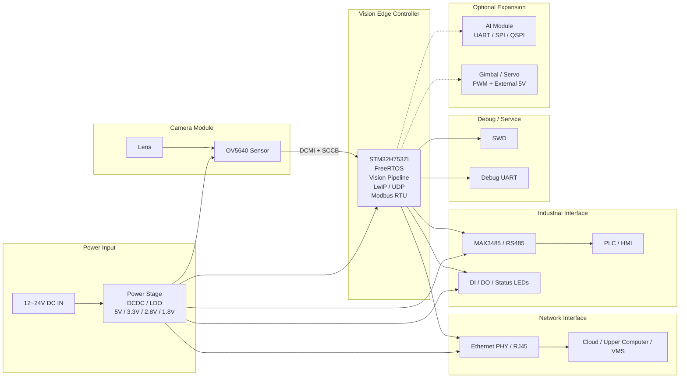

# 12. 求职版项目经历与作品集讲解

## 1. 最适合求职的简历文案

```text
2025.08 - 2025.10                                    高速入口车辆检测相机                                         - 边缘端系统开发
1.项目描述：基于 STM32H753ZI、OV5640、FreeRTOS 与 LwIP 开发工业智能相机边缘端，面向高速入口车辆抓拍与联动场景，完成图像采集、JPEG 图传、云端指令交互、RS485 工业通信及功耗管理等核心能力。
2.本人工作：
- 边缘端架构：负责设备侧软件架构设计与模块拆分，完成图像采集、网络通信、告警/舵机控制等核心链路开发，并推进多任务并行、Transport 抽象与 Netconn 重构方案。
- 图像链路：完成 OV5640 的 DCMI + DMA 接入，支持 JPEG/灰度模式切换，落地运动检测、自动曝光和低功耗模式切换，打通相机采图到缓存管理流程。
- 网络与协议：基于 LwIP 实现 UDP 图像分片上传与控制指令接收，设计设备侧通信协议与数据结构，提升设备与云端交互的稳定性和可扩展性。
- 工业接口：设计 USART2 + MAX3485 的 RS485 硬件接口与 Modbus RTU 从站方案，规划寄存器映射与 PLC/HMI 控制链路，支持抓拍、参数配置和状态读取。
- 嵌入式优化：结合 STM32H7 片上内存与外设资源，规划帧缓冲、ETH DMA 与 LwIP Heap 布局，并输出接口定义、引脚分配和转接板/产品化文档。
```

## 2. 面试口径统一

### 2.1 可以明确说“已完成”的内容

- 基于 `STM32H753ZI + OV5640 + FreeRTOS + LwIP` 的边缘端开发。
- `OV5640` 图像采集链路接入，包含 `DCMI + DMA`、`JPEG/灰度模式`、运动检测、自动曝光、功耗模式切换。
- 设备侧 `UDP` 图像上传与控制指令接收。
- `Alarm_Handler`、`Servo_Control` 等设备执行链路。
- `USART2 + MAX3485` 的 `RS485/Modbus RTU` 方案设计与接口规划。
- 项目协议文档、引脚分配、转接板和产品化硬件文档整理。

### 2.2 可以说“推进中/主导重构”的内容

- 从 V1 串行流程向 V2 并行任务模型重构。
- 从 `LwIP Raw API` 向 `Netconn API` 迁移。
- `Transport_HAL` 抽象层与 `ETH/RS485` 双通道解耦设计。
- 双缓冲帧队列、`Task_Camera/Task_NetTx/Task_NetRx/Task_RS485` 四任务方案。
- 面向产品化的 `RS485`、`DI/DO`、状态灯、转接板与量产板规划。

### 2.3 面试时不要说过头的点

- 不要说“做了本地 AI 推理”。
说明：当前文档口径是工业智能相机/边缘视觉平台，主链路仍是设备采图、预处理、上传与联动控制，不是完整的本地目标检测量产方案。
- 不要说“已经量产落地”。
说明：当前更准确的说法是“完成基础功能开发，并推进产品化接口与 PCB 方案设计”。
- 不要随口报固定性能数字。
说明：技术文档里对 V1/V2 吞吐提升有理论分析，但如果你没有亲自测过，就统一说“通过双缓冲与并行任务改善图传链路效率”。

## 3. 面向企业产品页风格的应用介绍

### 3.1 应用概览

高速入口车辆检测相机可定位为一款面向车道入口、园区通行口和工业现场出入口的智能视觉边缘节点。系统在边缘侧完成图像采集、基础预处理、以太网图传以及工业通信联动，可用于抓拍记录、状态联动和上位系统接入。

### 3.2 系统优势

- 边缘侧完成图像采集与基础预处理，降低上位系统对前端设备的控制复杂度。
- 以太网与 `RS485 Modbus RTU` 双链路并存，兼顾图像上传与工业现场控制。
- 基于 `STM32H753ZI` 的 MCU 级方案，兼顾实时性、功耗、BOM 成本和系统复杂度。
- 已形成从开发板联调到产品化接口规划的演进路径，便于后续做量产板与功能裁剪。

### 3.3 典型应用

- 高速入口车辆抓拍与状态上传
- 园区道闸、门禁或收费入口的视觉前端
- 工业现场通行口、物流节点或设备入口的图像记录与联动控制

### 3.4 对外介绍短版

本项目面向高速入口与工业通行场景，构建了一套基于 `STM32H753ZI` 的智能视觉边缘相机方案。设备侧集成图像采集、边缘预处理、`UDP` 图传、`RS485 Modbus RTU` 工业通信以及状态联动能力，可作为车道入口、园区通行口和工业出入口系统中的前端视觉节点，为上位机、云端平台或 `PLC/HMI` 提供稳定的图像与状态数据接口。

### 3.5 作品集开场文案

如果要用更像半导体企业产品页的方式介绍该项目，建议先把它定义成“面向高速入口与工业出入口场景的智能视觉边缘相机节点”，然后再展开系统价值。这样比直接从 `FreeRTOS`、`LwIP` 或 `RS485` 讲起更像完整解决方案，也更符合企业官网对应用方案的介绍逻辑。

### 3.6 产品/系统方框图

这类方框图适合放在作品集或 PPT 前半部分，作为系统级硬件概览页使用。建议用一页图把产品的主结构讲清楚，包括电源输入、相机模组、边缘控制器、网络接口、工业接口和调试接口，并明确哪些部分属于基础版硬件边界、哪些属于可选扩展。表达方式可以参考半导体企业官网中的应用方框图风格，但内容应严格保持与本项目当前技术文档一致。



图示说明：
- 基础版方框图中不放 `LCD` 与 `SDRAM`，因为当前产品化文档明确不建议在基础工业版引入这两部分。
- `AI Module` 与 `Gimbal / Servo` 以虚线表示可选扩展，不属于基础版主设计。
- 系统级表达应突出“相机模组 + 边缘控制器 + 网络接口 + 工业接口 + 电源输入”的主结构。

## 4. 作品集/PPT 讲解结构

下面内容可以直接做成 10 页左右的作品集文档，或按页做成 PPT。

### 第 1 页：项目定位

- 主题：高速入口车辆检测相机边缘端系统开发。
- 讲法：这是一个基于 `STM32H753` 的工业智能相机项目，设备侧负责采图、预处理、通信和联动控制，识别链路可与云端或上位系统结合。
- 重点：先把项目定义清楚，不要一上来就说“AI”，而是说“边缘端视觉采集与工业通信控制”。

### 第 2 页：为什么选 STM32H753

- 讲法：选 `STM32H753` 是因为它同时具备较强的主频、片上 SRAM、`DCMI`、`ETH`、定时器和丰富串口资源，适合做中高性能 MCU 级视觉边缘节点。
- 选择思路：
- 不上 Linux SoC，原因是系统复杂度、功耗、成本和启动实时性都不是当前阶段最优解。
- 不上 `SDRAM`，基础版本在当前分辨率和缓存策略下可用片内 SRAM 支撑。
- 不上 `LCD`，产品形态更偏工业节点而不是本地 HMI 终端。

### 第 3 页：系统核心功能拆解

- 图像侧：`OV5640` 采图、`JPEG/灰度模式`、运动检测、自动曝光。
- 通信侧：以太网 `UDP` 图像上传、控制指令接收。
- 工业侧：`RS485 Modbus RTU`、`DI/DO`、状态灯、告警联动。
- 讲法：强调这个项目不是单一相机驱动，而是“图像 + 网络 + 工业控制”三条链路并行设计。

### 第 4 页：为什么采用 FreeRTOS

- 讲法：项目需要同时处理相机采图、网络收发和串口控制，裸机方式难以清晰管理时序和模块边界，所以采用 `FreeRTOS`。
- 选择思路：
- V1 先跑通功能，采图和发送以较直接的方式闭环。
- V2 再把采图、发送、接收、RS485 拆成独立任务，减少耦合并提升吞吐。

### 第 5 页：V1 到 V2 的架构演进

- V1：`Task_Camera + Task_Net` 双任务模型，功能闭环快，但采集与发送存在串行耦合。
- V2：规划 `Task_Camera / Task_NetTx / Task_NetRx / Task_RS485` 四任务模型，通过消息队列和双缓冲解耦。
- 讲法：这里要突出你的工程判断，不是“推翻重来”，而是在已有功能跑通基础上做结构化重构。

### 第 6 页：图像链路为什么这样做

- 讲法：相机链路采用 `DCMI + DMA`，减少 CPU 直接搬运；图像分为 `JPEG` 与 `灰度` 两种工作模式，兼顾图传和检测需求。
- 选择思路：
- `JPEG` 用于图传，减少带宽压力。
- `灰度` 用于运动检测和轻量分析，降低处理成本。
- 自动曝光与功耗模式切换，是为了适应现场明暗变化和边缘设备长时间运行。

### 第 7 页：为什么选 UDP、为什么考虑 Netconn

- 讲法：图像上传采用 `UDP` 分片，重点是轻量、低时延、实现成本低，适合 MCU 侧连续图传场景。
- 选择思路：
- `UDP` 比 `TCP` 更容易控制开销和发送路径。
- 文档里已经定义设备侧图像分片协议与控制指令结构。
- 随着系统复杂度提升，需要从 `Raw API` 向 `Netconn API` 迁移，原因是更适合 RTOS 多任务场景，线程安全边界更清晰。

### 第 8 页：为什么加 RS485 / Modbus RTU

- 讲法：工业现场通常需要和 `PLC/HMI` 对接，仅靠以太网不够，所以引入 `RS485 Modbus RTU` 作为本地工业控制链路。
- 选择思路：
- 选 `USART2` 是因为与现有功能冲突较少，且 `PD4/PD5/PD6` 资源合适。
- 选 `MAX3485` 是因为原生 `3.3V`、BOM 简单、适合 MCU 直接配套。
- 采用 `Modbus RTU` 是因为行业兼容性高，便于参数配置、触发抓拍、状态读取。

### 第 9 页：内存与资源规划思路

- 讲法：这是 MCU 项目的核心亮点之一，重点不只是“代码写出来”，而是把 `D1/D2 SRAM`、帧缓冲、`ETH DMA`、`LwIP Heap` 分区规划清楚。
- 选择思路：
- 图像帧缓冲放到更合适的 SRAM 区域。
- 网络 DMA 和协议栈内存避开相机主链路冲突。
- 双缓冲和队列机制解决“采图时不能被发送阻塞”的问题。

### 第 10 页：产品化思路与工程落地

- 讲法：除软件外，我还整理了硬件接口与产品化方案，包括转接板、量产板、引脚分配和 BOM。
- 选择思路：
- 基础版不加 `SDRAM`、不加 `LCD`，控制 BOM 与复杂度。
- 保留 `Ethernet`、`RS485`、`DI/DO`、状态灯和调试接口。
- 云台/舵机作为验证功能或扩展 SKU，不混入基础工业版主设计。

## 5. PPT 每页推荐标题

- `1. 项目背景与目标`
- `2. 为什么选 STM32H753`
- `3. 系统功能与硬件组成`
- `4. FreeRTOS 架构设计`
- `5. 图像采集与处理链路`
- `6. UDP 图传与协议设计`
- `7. RS485/Modbus 工业接口设计`
- `8. 内存布局与性能优化`
- `9. 产品化接口与硬件规划`
- `10. 项目总结与个人收获`

## 6. 面试高频问题的标准回答思路

### 5.1 为什么不用 Linux 平台

- 当前项目更强调实时性、功耗、成本和工业控制接口集成，`STM32H753` 已经能覆盖现阶段边缘端需求。
- 如果后续需要复杂本地 AI 推理，再考虑外挂 AI 模块或更高算力平台，而不是一开始就把系统复杂度做高。

### 5.2 为什么不用 TCP 传图

- `UDP` 更适合 MCU 侧轻量图传，链路实现简单、状态少、延迟低。
- 图像本身可分片，偶发丢包对系统控制链路影响小；控制指令可独立设计校验和处理逻辑。

### 5.3 为什么要做 V2 架构重构

- V1 的价值是快速跑通功能闭环。
- V2 的价值是把“能跑”升级到“可扩展、可维护、可继续做产品化”，这是嵌入式项目中很关键的工程能力体现。

### 5.4 你在项目里最能体现能力的点是什么

- 不是单点驱动，而是把图像、网络、RTOS 和工业接口串成完整系统。
- 不只做功能实现，也做架构拆分、资源规划和硬件接口产品化整理。
