# 13. 作品集 PPT 逐页正文

> 说明：
> - 本文用于把项目整理成可直接讲解的 `PPT` 稿。
> - 每页均区分“已实现”和“推进中/规划中”，避免与技术文档口径不一致。
> - 图示采用 `Mermaid`，如需正式汇报，可直接截图放入 PPT。
> - 如需更像半导体企业官网中的应用介绍页，建议在技术页之前增加下面 3 张前导页。

## 应用介绍页 A：应用概览

### 页面标题

`高速入口车辆检测相机：面向入口管理与工业现场的智能视觉边缘节点`

### 页面要点

- 面向高速入口、园区通行口、工业出入口
- 边缘侧完成采图、基础预处理、图像上传与联动控制
- 同时对接云端平台与 `PLC/HMI`

### 逐页正文

如果用更接近半导体企业官网应用页的方式来介绍这个项目，我会先把它定义成一款面向入口管理与工业现场的智能视觉边缘节点，而不是直接从某个驱动模块开始讲。这个系统部署在入口侧，负责完成图像采集、基础预处理、图像上传、状态联动以及与上位系统的通信接入。

它的价值在于把前端视觉感知和工业通信能力集成到一个 MCU 级平台里，让设备既能把图像送到云端或上位机，也能通过 `RS485 Modbus RTU` 与 `PLC/HMI` 联动，适合用作高速入口、园区通行口和工业出入口场景中的前端视觉节点。这里要强调的是“智能视觉边缘节点”与“工业系统前端”的角色，而不是把它讲成一个孤立的相机模组。

### 参考文档

- `docx/12_Resume_Portfolio_Guide.md` §3.1, §3.4
- `docx/archive/08_TechnicalDesign.md` §1.1, §1.2
- `docx/archive/09_CommunicationProtocol.md` §1

### 结构图

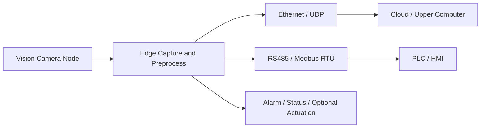

## 应用介绍页 B：系统优势

### 页面标题

`系统优势：兼顾视觉采集、工业通信与产品化可落地性`

### 页面要点

- 边缘侧完成图像采集与基础预处理
- `Ethernet + RS485` 双链路适配不同系统架构
- MCU 级平台控制成本、功耗与复杂度
- 已规划从开发板验证到产品化接口演进路径

### 逐页正文

这套方案的系统优势不在于堆高算力，而在于把视觉前端、网络传输和工业控制组合得足够平衡。第一，它在边缘侧完成图像采集与基础预处理，能够把前端节点做成相对独立的视觉单元。第二，它同时提供以太网和 `RS485` 两种链路，既适合图像上传，也适合和现场控制系统集成。第三，它基于 `STM32H753ZI` 这样的 MCU 平台实现，更有利于控制成本、功耗和系统复杂度。

从工程角度看，这个项目还不是只停留在“实验跑通”，而是已经形成了从 `NUCLEO-H753ZI` 联调到产品化接口规划的路线，包括引脚分配、接口边界、转接板与量产板思路。对于作品集来说，这一页的重点是让面试官先看到方案价值，再进入具体技术细节。

### 参考文档

- `docx/12_Resume_Portfolio_Guide.md` §3.2, §3.5
- `docx/archive/10_Hardware_Pinout_Productization.md` §1, §3, §9
- `docx/archive/08_TechnicalDesign.md` §3, §7

## 应用介绍页 C：典型应用与部署方式

### 页面标题

`典型应用：入口抓拍、通行联动与工业现场接入`

### 页面要点

- 高速入口车辆抓拍与状态上传
- 园区道闸、门禁或收费入口视觉前端
- 工业现场出入口、物流节点或设备入口记录

### 逐页正文

从应用部署角度看，这套系统比较适合三类场景。第一类是高速入口车辆抓拍，设备作为前端视觉节点完成抓拍与状态上传。第二类是园区通行场景，比如道闸、门禁或收费入口，设备既能上传图像，也能配合控制系统做联动。第三类是工业现场出入口或物流节点，用来做图像记录、状态采集和现场系统接入。

这类介绍方式更接近半导体企业官网里的应用方案逻辑，也更适合作品集开场。因为它先告诉面试官“这个系统放在哪、解决什么问题、怎么接入现有系统”，再去讲 `FreeRTOS`、`LwIP`、`RS485` 这些技术选择，会更完整，也更容易把技术点和业务价值对应起来。

### 参考文档

- `docx/12_Resume_Portfolio_Guide.md` §3.3
- `docx/archive/09_CommunicationProtocol.md` §1, §3
- `docx/archive/10_Hardware_Pinout_Productization.md` §2, §3

### 结构图

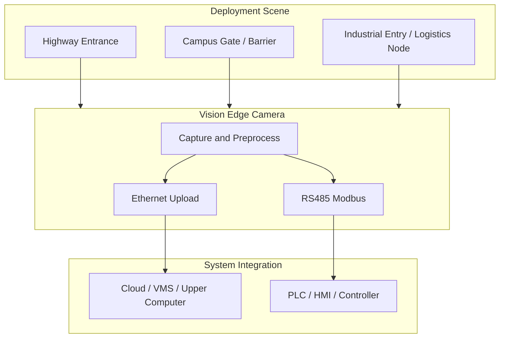

## 应用介绍页 D：产品/系统方框图

### 页面标题

`系统硬件方框图：基于 STM32H753ZI 的工业边缘视觉节点`

### 页面要点

- 基础系统由电源输入、相机模组、边缘控制器、网络接口、工业接口与调试接口构成
- 设备侧完成图像采集、基础预处理、以太网图传与 `RS485 Modbus RTU` 通信
- `AI` 模块与云台接口为可选扩展，采用虚线表示，不纳入基础版硬件边界

### 逐页正文

这一页从硬件系统层面说明产品组成与接口边界。系统以 `STM32H753ZI` 为核心控制器，连接 `OV5640` 相机模组，完成图像采集、基础预处理、网络通信与工业控制。外部 `12~24V DC` 电源经 `DCDC/LDO` 转换后，为主控、相机、通信接口和状态/输出电路提供所需工作电压。

在对外连接上，系统通过 `Ethernet PHY / RJ45` 与云端或上位机通信，通过 `MAX3485` 引出的 `RS485` 总线与 `PLC/HMI` 对接，并保留 `DI/DO`、状态灯、`SWD` 和 `Debug UART` 作为现场联动与维护接口。按照当前产品化规划，基础工业版不引入 `LCD` 与 `SDRAM`；如需展示 `AI` 模块或云台能力，应作为可选扩展单独标识，避免与现阶段硬件边界混淆。

### 参考文档

- `docx/archive/10_Hardware_Pinout_Productization.md` §1, §3, §12, §13
- `docx/11_LCEDA_Schematic_Input_NUCLEO_Adapter.md` §2, §3
- `docx/12_Resume_Portfolio_Guide.md` §3.6

### 结构图

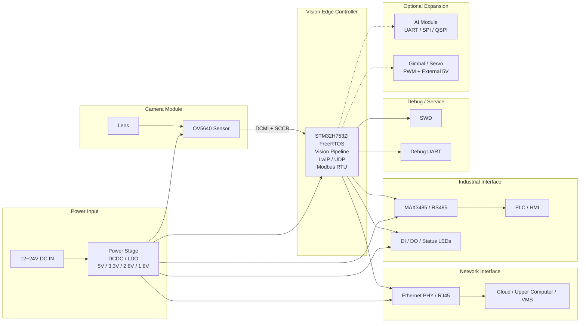

## 第 1 页：项目背景与目标

### 页面标题

`高速入口车辆检测相机：STM32H753 边缘端系统开发`

### 页面要点

- 平台：`STM32H753ZI + OV5640 + FreeRTOS + LwIP`
- 场景：高速入口车辆抓拍、联动控制、工业现场接入
- 设备侧职责：采图、预处理、图传、指令执行、工业通信

### 逐页正文

这个项目的定位不是单纯做一个摄像头驱动，而是做一套 MCU 级工业智能相机边缘端。硬件核心是 `STM32H753ZI` 和 `OV5640`，软件上运行 `FreeRTOS` 与 `LwIP`。设备侧主要承担三类任务：第一是图像采集和基础预处理，第二是通过以太网把图像上传到云端并接收控制指令，第三是通过 `RS485 Modbus RTU` 对接 `PLC/HMI`，满足工业现场联动需求。

我在这个项目中的角色主要是边缘端系统开发，工作既包括相机、RTOS、网络通信，也包括 `RS485` 工业接口和产品化硬件接口整理。对外我会把它定义成“工业智能相机边缘端系统开发”，而不是直接说“本地 AI 相机”，因为当前文档口径里，主链路仍然是采图、上传、联动和工业控制。

### 参考文档

- `docx/archive/08_TechnicalDesign.md` §1.1, §1.2
- `CLAUDE.md` `Project Overview`
- `docx/12_Resume_Portfolio_Guide.md` §2.3

### 结构图

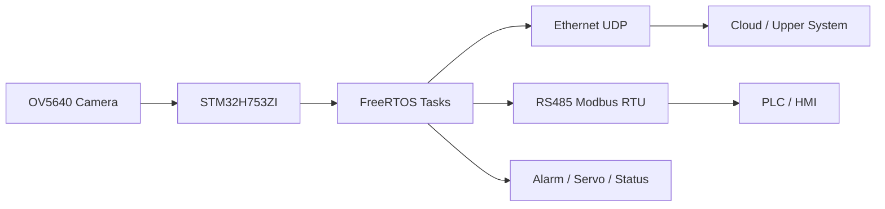

## 第 2 页：为什么选 STM32H753

### 页面标题

`平台选型：为什么是 STM32H753，而不是 Linux SoC`

### 页面要点

- 有 `DCMI`、`ETH`、定时器、串口等关键外设
- 片上 SRAM 资源足够支撑当前分辨率与缓存策略
- 兼顾成本、功耗、实时性和工业接口集成

### 逐页正文

这类项目一开始经常会被问，为什么不用 Linux 平台或者更高算力 SoC。我的判断是，当前项目更强调实时性、功耗、BOM 成本和工业接口集成，而不是在端侧跑复杂的大模型推理。`STM32H753` 的优势在于主频高、片上 SRAM 较大，同时有 `DCMI`、以太网、定时器和丰富的串口资源，可以在 MCU 级平台上把视觉采集、网络图传和工业控制组合起来。

另外，从当前文档规划看，基础版本并不建议加 `SDRAM` 或 `LCD`。原因不是做不到，而是当前阶段没有必要。以现有分辨率和双缓冲思路，片上 SRAM 还能支撑；而产品形态也更像工业节点，不是本地 HMI 终端。这种选型方式更符合工程落地，而不是为了“看起来更强”而提前堆复杂度。

### 参考文档

- `docx/archive/08_TechnicalDesign.md` §1.1
- `docx/archive/10_Hardware_Pinout_Productization.md` §1.1, §1.2
- `docx/12_Resume_Portfolio_Guide.md` §5.1

## 第 3 页：系统功能与硬件组成

### 页面标题

`系统拆解：图像、网络、工业控制三条主链路`

### 页面要点

- 图像链路：采集、模式切换、运动检测、自动曝光
- 网络链路：`UDP` 图传、云端指令接收
- 工业链路：`RS485 Modbus RTU`、`DI/DO`、状态灯

### 逐页正文

从系统功能看，这个项目至少包含三条主链路。第一条是图像链路，核心包括 `OV5640` 采图、`JPEG/灰度模式` 切换、运动检测和自动曝光。第二条是网络链路，设备通过以太网上传图像并接收云端控制命令。第三条是工业链路，设备通过 `RS485 Modbus RTU` 对接 `PLC/HMI`，并预留 `DI/DO` 与状态灯等现场接口。

我觉得这个项目对求职比较有价值的地方就在这里，它不是单点驱动开发，而是把图像、RTOS、网络协议和工业接口串成一个完整系统。面试时这一页重点不是列功能，而是强调自己对系统边界和链路拆解有清晰理解。

### 参考文档

- `docx/archive/08_TechnicalDesign.md` §1.1, §1.2
- `docx/archive/09_CommunicationProtocol.md` §1, §2, §3
- `docx/archive/10_Hardware_Pinout_Productization.md` §2, §3

### 结构图

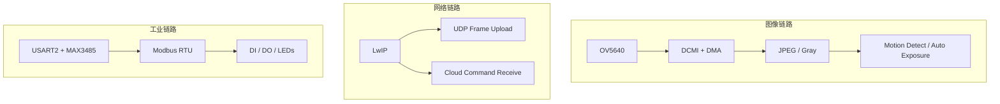

## 第 4 页：FreeRTOS 架构设计

### 页面标题

`为什么采用 FreeRTOS：从功能跑通到结构解耦`

### 页面要点

- V1：双任务模型，快速闭环
- V2：四任务并行模型，采集/发送/接收/RS485 解耦
- 关键机制：队列、信号量、任务优先级

### 逐页正文

这个项目采用 `FreeRTOS` 的核心原因，是设备要同时处理相机采图、网络收发和串口控制。如果用裸机方式，功能当然也能堆出来，但时序、优先级和模块边界会越来越乱。

在当前文档里，V1 是先用双任务模型快速把功能跑通，也就是 `Task_Camera + Task_Net`。这种方式的优点是闭环快，但缺点是采图和发送串行耦合。V2 的目标则是拆成 `Task_Camera`、`Task_NetTx`、`Task_NetRx` 和 `Task_RS485`，通过消息队列和双缓冲把采图、发送、接收和工业控制分开。这里我的价值不是简单“把任务变多”，而是明确哪些模块该并行、哪些动作该同步，以及怎么用 `FreeRTOS` 对象把同步边界理顺。

### 参考文档

- `docx/archive/08_TechnicalDesign.md` §2.1, §3.2
- `docx/archive/08_TechnicalDesign.md` §4.1, §4.2, §4.4, §4.5, §4.6
- `CLAUDE.md` `Architecture`

### 结构图

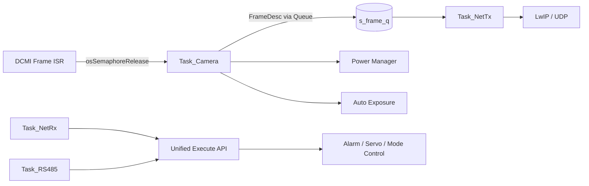

### 同步与流水线说明

- `DCMI ISR -> 信号量 -> Task_Camera`
- `Task_Camera -> 消息队列 -> Task_NetTx`
- `Task_NetRx / Task_RS485 -> 统一执行接口`
- 采图与发送形成生产者-消费者流水线

## 第 5 页：图像采集与处理链路

### 页面标题

`OV5640 图像链路：为什么用 DCMI + DMA + 模式切换`

### 页面要点

- `DCMI + DMA` 降低 CPU 搬运负担
- `JPEG` 兼顾图传带宽，`灰度` 兼顾检测成本
- 自动曝光与功耗管理面向现场稳定运行

### 逐页正文

图像链路是这个项目最底层但也最关键的部分。采集侧采用 `DCMI + DMA`，这样可以避免 CPU 参与大块数据搬运。业务上并不是始终只做一种格式，而是分成 `JPEG` 和 `灰度` 两种模式：`JPEG` 主要面向图像上传，减少网络带宽压力；`灰度` 主要面向运动检测和轻量分析，降低处理成本。

在这条链路上，我还参与了自动曝光和功耗模式切换逻辑。原因是工业场景里环境光变化和设备长时间运行都很常见，只把图采下来还不够，还要让设备在不同场景下稳定工作。所以面试时我会把这部分表述成“图像链路和设备运行状态一起考虑”，而不是单独谈一个驱动。

### 参考文档

- `docx/archive/08_TechnicalDesign.md` §1.2
- `docx/archive/08_TechnicalDesign.md` §2.3
- `CLAUDE.md` `APP 层模块`

### 结构图

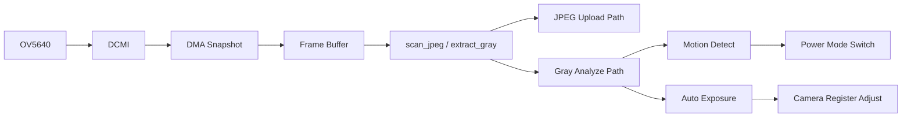

## 第 6 页：LwIP 与 UDP 图传设计

### 页面标题

`为什么选 UDP，以及为什么推进 Netconn 迁移`

### 页面要点

- `UDP`：轻量、低时延、适合 MCU 侧图传
- 图像采用分片协议，控制命令独立结构
- `Netconn` 更适合 RTOS 多任务场景

### 逐页正文

图像上传这条链路采用的是 `UDP`，主要考虑三点：第一是实现轻量，第二是时延低，第三是更适合 MCU 侧连续发送。这里并不是说 `TCP` 不好，而是当前阶段更适合把图像链路做成轻量分片传输，把可靠性问题控制在协议和业务层。文档里已经定义了图像分片头、帧编号和控制命令结构，这些都是设备与云端交互的基础。

随着系统从 V1 进入 V2，网络侧也要从 `LwIP Raw API` 逐步迁移到 `Netconn API`。这个变化的重点不是“换个 API”，而是为了更适配 `RTOS` 多任务场景，让发送和接收线程的边界更清晰，减少跨线程直接操作协议栈带来的风险。这一页在面试里很适合体现你对协议栈选型和线程安全问题的理解。

### 参考文档

- `docx/archive/09_CommunicationProtocol.md` §2.2, §2.3, §2.4
- `docx/archive/08_TechnicalDesign.md` §2.2, §3.5
- `docx/archive/08_TechnicalDesign.md` §4.9

### 结构图

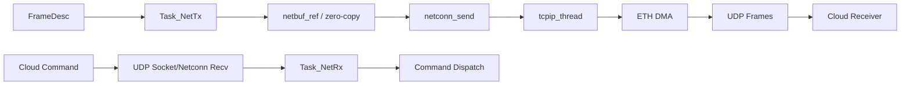

### 图传协议说明

- 上行：图像分片上传
- 下行：云端命令下发
- 发送链路关注吞吐，接收链路关注解析和调度

## 第 7 页：RS485 / Modbus RTU 设计

### 页面标题

`为什么引入 RS485 / Modbus RTU：补齐工业现场控制链路`

### 页面要点

- 以太网适合图传，`RS485` 适合现场控制
- `USART2 + MAX3485` 冲突少、3.3V 友好
- `Modbus RTU` 便于 `PLC/HMI` 集成

### 逐页正文

工业现场通常不会只接受以太网方案，尤其是和 `PLC/HMI` 的对接，`RS485 Modbus RTU` 的兼容性和落地性都更高。所以我把这个项目的通信职责拆成两部分：以太网主要承载图像上传和云端控制，`RS485` 主要承载本地工业控制和参数交互。

在硬件接口上，项目里选择的是 `USART2 + MAX3485` 方案。`USART2` 的 `PD4/PD5/PD6` 与现有功能冲突较少，`MAX3485` 则是因为原生 `3.3V`，适合 MCU 直接配套。软件上采用 `Modbus RTU` 从站方式，用寄存器映射抓拍、功耗模式、告警和参数配置等功能。这一页建议重点讲“为什么这么选”，而不只是说“我接了个 485”。

### 参考文档

- `docx/archive/08_TechnicalDesign.md` §5.1, §5.2, §5.3
- `docx/archive/09_CommunicationProtocol.md` §3.1, §3.2, §3.3, §3.5
- `docx/archive/10_Hardware_Pinout_Productization.md` §5.2, §12.2.2, §12.2.2.1

### 结构图

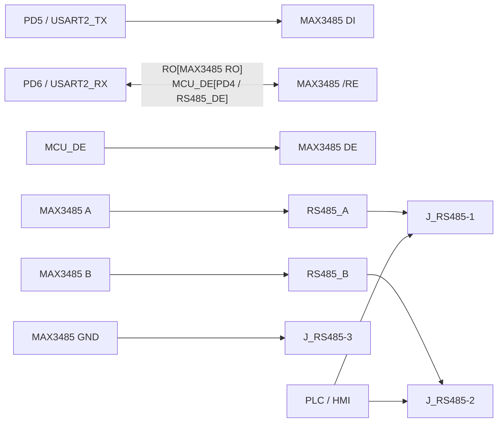

### 软件交互图


## 第 8 页：内存布局与性能优化

### 页面标题

`MCU 项目的关键点：内存布局和缓冲策略`

### 页面要点

- 图像帧缓冲、`ETH DMA`、`LwIP Heap` 分区
- 避免采图与发送直接争用同一块内存
- 双缓冲和队列是结构优化重点

### 逐页正文

做 MCU 级视觉系统，真正拉开差距的往往不是单个功能，而是内存和资源怎么规划。这个项目里，图像帧缓冲、`ETH DMA` 和 `LwIP Heap` 都要在有限片上内存里安排清楚。如果这些区域混得不清楚，系统很容易出现采图和发送相互阻塞、缓存被覆盖或协议栈不稳定的问题。

所以我在项目里比较关注的一点，就是把图像缓存和网络相关内存分开规划，再结合双缓冲和队列，把“采图”和“发图”变成可并行的生产者-消费者模式。面试时这一页能很好地体现你不只是写功能，而是能站在资源约束下做系统设计。

### 参考文档

- `docx/archive/08_TechnicalDesign.md` §3.3
- `docx/archive/08_TechnicalDesign.md` §4.7, §4.8
- `CLAUDE.md` `关键内存布局`

### 结构图

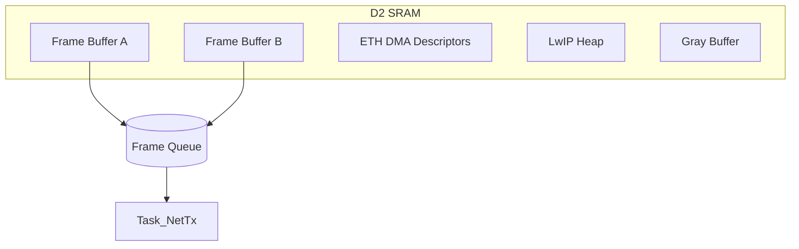

## 第 9 页：产品化接口与硬件规划

### 页面标题

`从开发板验证到产品化：接口、转接板与量产边界`

### 页面要点

- 开发板阶段：`NUCLEO-H753ZI + 转接板`
- 产品化阶段：保留 `Ethernet / RS485 / DI/DO / 状态灯 / 调试接口`
- 基础版不引入 `SDRAM`、`LCD`、云台驱动

### 逐页正文

除了软件，我还整理了项目的产品化接口和硬件规划。当前更准确的说法不是“已经量产”，而是已经从开发板验证路线延伸到产品化接口定义，包括 `NUCLEO-H753ZI` 转接板方案、量产主板引脚规划以及 `BOM` 建议。

在产品化思路上，我主张基础工业版先控制复杂度，不引入 `SDRAM`、`LCD` 和板载云台驱动，优先保留 `Ethernet`、`RS485`、`DI/DO`、状态灯和调试接口。这样既贴合工业节点定位，也能让硬件和软件边界更清晰。像云台、边缘 AI 等能力，我会定义成可选扩展，而不是混进基础版本里。

### 参考文档

- `docx/archive/10_Hardware_Pinout_Productization.md` §1, §3, §5, §12, §13
- `docx/11_LCEDA_Schematic_Input_NUCLEO_Adapter.md` §2, §3, §5

### 结构图

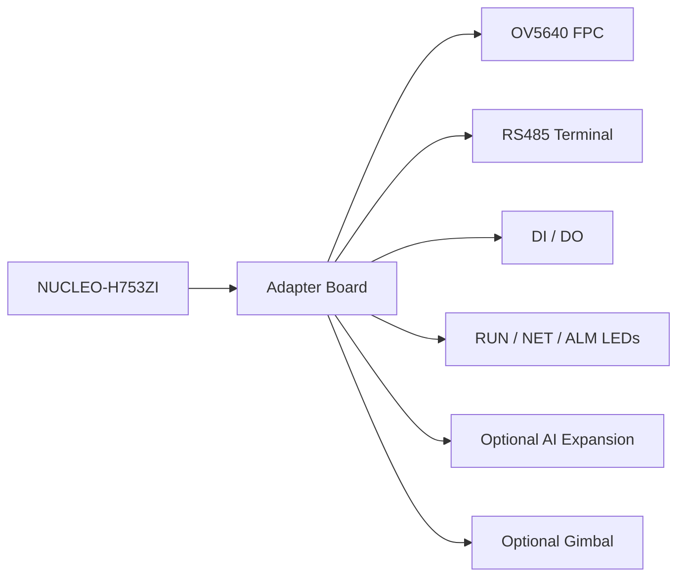

## 第 10 页：项目总结与个人收获

### 页面标题

`项目总结：我在这个项目里真正体现的能力`

### 页面要点

- 不是单点驱动，而是完整系统串联
- 既做功能闭环，也做架构演进和产品化整理
- 对“已完成”和“规划中”有清晰边界

### 逐页正文

我认为这个项目里最能体现个人能力的地方，不是单纯把某个外设点亮，而是把图像采集、`FreeRTOS` 架构、`LwIP` 图传、`RS485 Modbus` 和硬件接口规划串成了一个完整系统。同时，我对项目阶段也有比较清晰的边界意识：哪些是已经跑通并完成文档沉淀的，哪些是我主导推进中的架构重构和产品化设计。

如果用一句话概括这个项目经历，我会说：这是一个以 `STM32H753` 为核心的工业智能相机边缘端项目，我负责把相机、RTOS、网络与工业接口整合成可演进的工程系统，并推动它从“能跑”走向“可扩展、可产品化”。

### 参考文档

- `docx/12_Resume_Portfolio_Guide.md` §2, §5
- `docx/archive/08_TechnicalDesign.md` §7
- `docx/archive/10_Hardware_Pinout_Productization.md` §8, §9

## 附录 A：PPT 使用建议

- 如果需要更像企业应用页风格，建议顺序改为“应用概览 -> 系统优势 -> 典型部署 -> 项目背景 -> 平台选型 -> 系统拆解 -> RTOS -> 图像 -> 网络 -> 工业接口 -> 资源优化 -> 产品化 -> 总结”。
- 技术面试版本仍建议按“项目背景 -> 平台选型 -> 系统拆解 -> RTOS -> 图像 -> 网络 -> 工业接口 -> 资源优化 -> 产品化 -> 总结”走，不要一开始就讲局部实现。
- 每一页只突出一个技术决策，不要把所有模块细节堆在同一页。
- 面试时一律避免把“V2 目标架构”说成“全部已经量产上线”，统一表述为“已完成基础功能，正在推进结构重构和产品化设计”。
- 如果需要缩短到 5 分钟，可优先讲第 `1/2/4/6/7/10` 页。

## 附录 B：可直接复用的首页摘要

```text
本项目是基于 STM32H753ZI、OV5640、FreeRTOS 与 LwIP 的工业智能相机边缘端开发。设备侧负责图像采集、JPEG 图传、云端控制指令接收、RS485 Modbus RTU 工业通信以及告警/状态联动。我主要负责边缘端软件架构、图像链路、网络协议、RS485 接口方案以及产品化接口文档整理，并推动系统从功能闭环向并行任务和可扩展架构演进。
```
