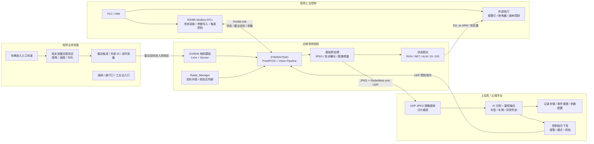
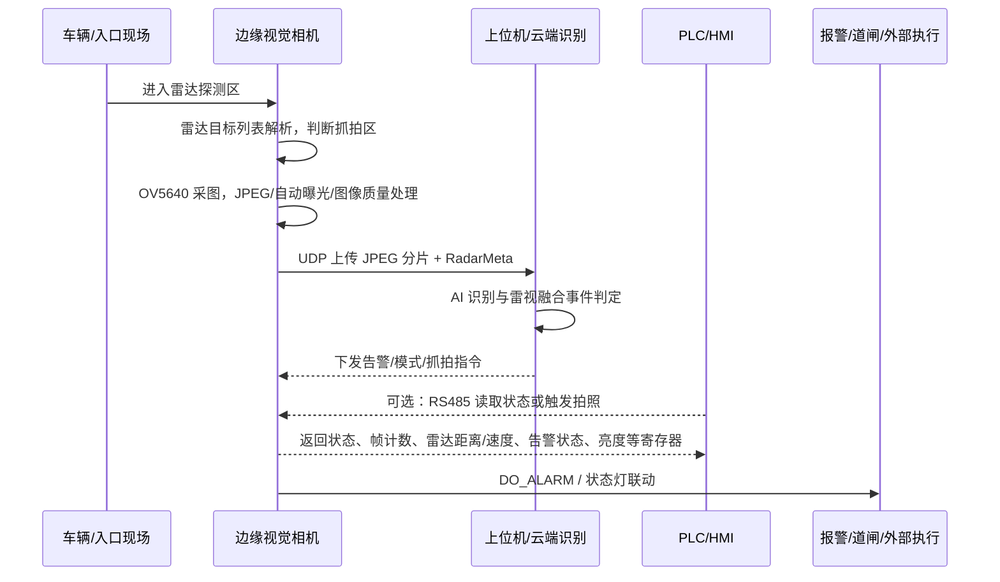

# 业务框图与 Visio 绘制说明

> 文档编号: 14 | 用于作品集、PPT 和方案介绍中的业务层框图绘制。
> 本图不是硬件原理图，也不是软件任务图；它用于说明“设备放在什么业务场景中、与哪些系统交互、业务数据如何闭环”。

## 1. 图名与定位

推荐图名：

`高速入口车辆检测相机业务框图`

一句话定位：

基于 `STM32H753ZI + OV5640 + FreeRTOS + LwIP` 的工业边缘视觉相机，部署在高速入口、园区通行口或工业出入口，负责前端采图、基础预处理、图像上传、现场控制接入和状态联动；雷达增强版新增毫米波雷达目标检测，用于雨雾、低照度和逆光场景下的车辆存在、速度、距离和方向判断；云端或上位机负责 AI 识别和复杂雷视融合，`PLC/HMI` 负责现场节拍、联锁和执行控制。

## 2. Visio 主图布局建议

画布建议使用 `16:9` 横向布局，采用“从左到右的业务闭环”。

| 区域 | 推荐位置 | 画面元素 | 业务含义 |
|---|---|---|---|
| 现场场景 | 左侧 | 车道、车辆、补光/触发点、雷达探测区、相机安装位 | 车辆进入检测区域，产生抓拍或检测需求 |
| 边缘相机 | 中左 | `OV5640`、毫米波雷达、`STM32H753ZI`、状态灯、DI/DO | 雷达提供全天候目标信息, 相机提供图像证据, MCU 完成触发和状态联动 |
| 网络/平台 | 中右 | 交换机、上位机/云端、AI 识别模块、数据库/VMS | 接收 JPEG 图像，完成识别、存储、配置和结果下发 |
| 工业控制 | 右侧 | `PLC/HMI`、RS485 总线、报警灯、道闸/继电器 | 现场控制系统读取状态、触发拍照、执行联动 |
| 维护调试 | 下方细条 | `SWD`、Debug UART、参数配置、日志 | 产测、调试、维护和固件升级路径 |

## 3. 推荐概念图像元素

Visio 或 PPT 中建议使用简洁线性图标，不使用复杂照片背景。推荐放入以下概念图像：

| 概念图像 | 放置位置 | 说明文字 |
|---|---|---|
| 车辆/车道图标 | 左侧现场场景区 | `Vehicle / Entrance Lane` |
| 工业相机图标 | 中左边缘设备区 | `Edge Vision Camera` |
| MCU/芯片图标 | 相机内部小框 | `STM32H753ZI` |
| 摄像头传感器图标 | 相机内部小框 | `OV5640 / DCMI` |
| 毫米波雷达图标 | 现场与相机之间或相机内部小框 | `mmWave Radar / Target List` |
| 云端或上位机图标 | 中右平台区 | `Cloud / Upper Computer / VMS` |
| AI 推理图标 | 平台区内部 | `AI Recognition on Host Side` |
| PLC 机柜图标 | 右侧工业控制区 | `PLC / HMI` |
| 双绞线/端子图标 | 相机与 PLC 之间 | `RS485 Modbus RTU` |
| 报警灯/继电器图标 | 右侧执行区 | `Alarm / DO Output` |
| 调试接口图标 | 下方维护区 | `SWD / Debug UART` |

## 4. 业务闭环主图

该图适合直接转成 Visio：每个 `subgraph` 对应一个大分区，每个节点对应一个图标或模块框。

## 5. 典型业务流程图

该图用于补充主图，说明一次车辆事件如何从现场进入系统并形成闭环。

## 6. 图中必须体现的业务边界

- 边缘相机负责：图像采集、基础预处理、雷达目标列表接收、抓拍区判断、UDP 图传、云端指令接收、`RS485 Modbus RTU`、`DI/DO`、状态指示。
- 上位机或云端负责：AI 推理、复杂雷视融合、事件判断、图像存储、识别结果管理和部分控制指令下发。
- `PLC/HMI` 负责：现场节拍、触发抓拍、参数读写、状态查询和执行机构联动。
- 基础工业版不画 `LCD`、`SDRAM`、板载云台驱动；这些不属于当前基础版业务闭环。
- 雷达增强版可以画入主业务链路; 云台、边缘 AI 模块、本地存储仍画成虚线“可选扩展”。

## 7. Visio 视觉风格建议

- 使用横向流程图，主箭头方向为左到右：`现场 -> 相机 -> 平台 -> 控制/执行`。
- 每个大区域使用浅色背景框，边缘相机区域可使用更醒目的蓝色边框，突出设备本体。
- 实线箭头表示基础版必需链路，虚线箭头表示可选扩展链路。
- 数据链路建议使用蓝色：`JPEG over UDP`、`控制指令`。
- 工业控制链路建议使用绿色或深灰：`RS485 Modbus RTU`、`DI/DO`。
- 告警或异常结果建议使用橙色：`Alarm`、`Violation Event`。
- 每个模块框内控制在 2 行以内，第一行为模块名，第二行为关键职责。

## 8. 可直接放到 PPT 的页面文案

页面标题：

`业务框图：从入口抓拍到云端识别与现场联动`

页面要点：

- 前端设备部署在入口车道或工业出入口，雷达负责全天候目标触发，相机负责图像证据。
- 图像和 `RadarMeta` 通过以太网 `UDP` 上传到上位机或云端，平台完成 AI 识别和雷视融合。
- `PLC/HMI` 通过 `RS485 Modbus RTU` 读取设备状态、雷达目标、融合结果或写入参数，实现现场系统集成。

讲解稿：

这一页展示的是雷达增强后的业务层闭环，而不是单个硬件模块。车辆进入入口区域后，毫米波雷达先提供目标存在、距离、速度、方向和车道信息，`STM32H753ZI` 根据目标是否进入抓拍区决定是否唤醒相机并触发 `OV5640` 抓拍。相机侧继续负责 JPEG 图像、自动曝光和图像质量控制，雷达侧负责恶劣天气下的目标确认。

设备通过以太网把 JPEG 和 `RadarMeta` 上传到上位机或云端，由平台完成 AI 识别和复杂雷视融合。在现场控制侧，设备通过 `RS485 Modbus RTU` 与 `PLC/HMI` 对接，支持状态读取、雷达目标读取、参数配置和触发抓拍；同时通过 `DI/DO` 和状态灯完成外部触发与告警联动。这样系统形成了“雷达触发、边缘采集、平台融合、现场执行”的闭环，同时保持基础版无 `LCD`、无 `SDRAM`，云台/本地 AI 仍作为可选扩展的边界。

## 9. 参考文档

- [03_Architecture.md](/E:/STM32/OV/docx/03_Architecture.md)：系统架构、V2 并行数据流、任务职责。
- [08_TechnicalDesign.md](/E:/STM32/OV/docx/08_TechnicalDesign.md)：软硬件平台、V1/V2 架构演进、任务拓扑。
- [09_CommunicationProtocol.md](/E:/STM32/OV/docx/09_CommunicationProtocol.md)：以太网 UDP、RS485 Modbus RTU、双控制源。
- [10_Hardware_Pinout_Productization.md](/E:/STM32/OV/docx/10_Hardware_Pinout_Productization.md)：产品职责边界、基础版接口、可选扩展边界。
- [13_Portfolio_PPT_Script.md](/E:/STM32/OV/docx/13_Portfolio_PPT_Script.md)：作品集/PPT 展示口径和系统硬件方框图。
